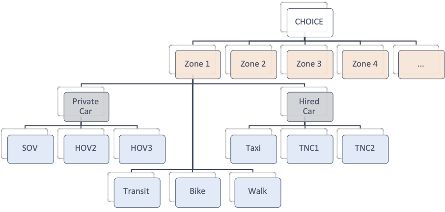

# Mode, Destination, and Time of Day User Guide

This document describes the Mode, Destination, and Time of Day (MDT) models,
including the basic conceptual structure, input files used, output files 
generated, and method of operation.

## Model Structure

The CMAP trip-based model's MDT models are implemented in Python, using modern 
multiprocessing techniques to greatly enhance the sensitivity and detail of the 
model, without significantly increasing the overall model runtime.

### Joint Mode and Destination

The model includes an integrated mode and destination choice model. The mode and 
destination choice model was estimated as a single model using full-information 
maximum likelihood methods, which represents a significant theoretical enhancement 
over two-step models (i.e. models where mode choice logsums are computed based on 
the estimated mode choice model, and those logsums are used as static input values 
when estimating parameters for a destination choice model).

The integrated mode and destination choice model is represented as a hierarchical 
nested logit model.  The top of the nesting hierarchy represents the attraction 
zone for each trip. For all home-based trips the attraction end is the non-home, 
while for non-home-based trips it is modeled as the actual destination of the 
trip in the normal sense.  Below the attraction nest, the mode choice is further 
sub-nested, with all private auto modes (SOV, HOV2, HOV3) grouped in one nest, 
and all public auto modes (Taxi, TNC1, TNC2) grouped in a different nest.

For application, as this is a semi-aggregate model, there is no sampling of 
alternatives.  Thus, for each trip, the number of mode and destination alternatives
is 3632 zones times 9 modes = 32,688 alternatives.

### Mode Choices

The set of alternatives included explicitly in the mode choice level of the model  
includes 9 discrete alternatives:

1. SOV: Single occupant private vehicle (driving alone)
2. HOV2: 2-person trip in a private vehicle
3. HOV3: 3 or more persons sharing a private vehicle
4. Taxi
5. TNC1: Regular ride hail (e.g. Uber or Lyft)
6. TNC2: Shared ride hail (e.g. Uber Pool or Lyft Line)
7. Transit
8. Bike
9. Walk

### Transit Access and Egress

To facilitate the implementation for these models, the calculation of transit 
access and egress levels of service has been ported from Fortran to Python.  
The actual mathematical logic underpinning these level of service calculations 
is unchanged from the previous model, and is still based on a random distribution 
of transit access characteristics computed based on the geography of each zone.

### Work from Home Segmentation

The unfolding pandemic has introduced a new wrinkle in travel demand forecasting: 
unexpectedly large and deep uncertainty about the future of “work from home” 
(WFH) behaviors.   

A fundamental challenge in modeling changing WFH behavior is that it impacts not 
just the presence or absence of work trips, but also the number and temporal and 
geographic distribution of non-work trips.  A remote worker has much more limited 
opportunity to undertake non-home-based trips in the middle of the day around the 
workplace (e.g. going out for lunch in the loop) and much greater opportunity to 
make home-based trips.  

The trip-based model has been built to include sensitivity to changes
in WFH, by bifurcating the regional population into two groups: households 
that have at least one worker who works from home at least sometimes, and 
households that have no WFH activity.  Athough the parameters of the mode and 
destination choice models are the same for both groups, the trip productions and
attractions by zone for these two groups differ, resulting in unique utility 
functions and different behavior patterns for each.  

### Time of Day Models

Although the mode and destination models are fully integrated, the time of day 
models are estimated and applied separately as an independent step. These models, 
which are applied only to automobile based modes (of both private and hired car 
varieties), are sensitive to changes in congested travel times over the course 
of the day. They are structured as a simple multinomial logit model, despite the
fact that the 8 modeled time periods are heterogeneously sized. This is not 
problematic, as these models all include a complete set of alternative specific
constants, which represent not only behavioral preferences but also the aggregate
size (i.e. duration) of each time period.

The utility functions for the time of day models are relatively simple compared 
to the mode and destination models, as the differentiation available across the 
alternatives is limited.  Nevertheless, the models are structured to be sensitive 
to congested travel times, as well as mode choice, as TNC usage exhibits a vastly
different temporal pattern than private auto usage, with many TNC rides clustered
in the evening and overnight hours.

## Input Files

The descriptions here are focused on technical implementation,
i.e. what appears in these files, not where these values should come from.

In most cases, there are several possible locations for each input file, which 
are identified as "alternative file search locations"`under each heading.  In
each case, the model checks each location in the order shown to find the file,
and the first location where a file exists is the location actually used.  
Typically, files stored directly in the "Database" directory are preferred, but 
fallback files from other locations can also used.  This allows the MDT models to
run even if, for example, EMME has not been used to prepare a scenario specific
input file.

In addition to the files below, the MDT models also read a wide variety of skim
data from various EMME matrix files found in the `emmemat` directory.

### HW_CBDPARK.TXT

Alternative file search locations:
- HW_CBDPARK.TXT
- defaults_base_year/HW_CBDPARK.TXT

This file contains CBD parking cost inputs. Two different sets of records are 
included in the file. The first set identifies the parking supply characteristics 
of each CBD zone that contains parking. Each zone in this set has five records 
with the following information:

- CBD parking zone number.
- The probability of finding parking within the zone at the threshold parking 
  cost (this value must be 100 percent in each zone’s fifth record).
- The threshold parking cost in cents per hour.
- The savings in parking costs in cents per hour determined by subtracting the 
  threshold parking cost from the maximum parking cost in the zone.
- The amount of time needed to walk one block in the CBD (180 seconds).

Parking user characteristics are included in the second set of records in the 
CBD parking file – these correspond to the final five records in the file. These 
records are ordered by household income ranges and include the following variables 
for CBD commuters:

- The upper value of the household income quintile range (last record is the 
  lower bound of the highest quintile).
- The percentage of CBD auto commuters with free parking.
- The percentage of all CBD workers taking transit to CBD.
- The percentage of CBD auto commuters in single occupant vehicles.
- The percentage of CBD auto commuters ridesharing in two person vehicles
- The percentage of CBD auto commuters carpooling in three person vehicles.
- The percentage of CBD auto commuters carpooling in four or more person vehicles.

### ALLPURPOSE_M01.TXT

Alternative file search locations:
- ALLPURPOSE_M01.TXT
- defaults_base_year/ALLPURPOSE_M01.TXT

The M01 file stores several variables to provide the mode choice and distribution 
models with zonal transit availability and park and ride characteristic parameters. 
Some of the parameters are calculated using transit network characteristics and 
are specific to each scenario network. The contents of the M01 file are summarized:

1. Zone Number 
2. Zone Type  
   - 1=Chicago downtown
   - 2=Rest of Chicago
   - 3=dense suburban CBD
   - 4=all other zones
3. Park and Ride Cost  
     The cost of parking at the park and ride lot closest to the zone’s geographic 
     centroid. This represents the lowest rate of either the daily parking rate or the cost of a monthly parking pass divided by twenty work days.
4. Median zone household income  
     The median household income in the zone (in $100s)
5. Park and ride availability
     A binary value indicating that the zone has park and ride access if 
     there is a park and ride location within ten miles of the zone’s 
     geographic centroid.
6. Average waiting time for bus service in zone for home-work trips
7. Average waiting time for bus service in zone for non-work trips
8. Average waiting time for feeder bus service in zone for home-work trips
9. Average waiting time for feeder bus service in zone for non-work trips
10. Home-work trip auto work end auto occupancy

> Note: In prior version of the CMAP trip-based model, separate nearly identical copies 
> of the M01 files were needed to support pre-distribution and mode choice
> components, e.g. PDHW_M01 and MCHW_M01.  The current model does not require 
> separate files, so the model reads only a common file with an ALLPURPOSE prefix.

### ALLPURPOSE_M023.TXT

Alternative file search locations:
- ALLPURPOSE_M023.TXT
- defaults_base_year/ALLPURPOSE_M023.TXT

The M023 file contains transit fare and auto operating cost data used by the 
distribution and mode choice models. The file is composed of six records:

1. CTA fares;
2. Pace feeder bus fares;
3. Pace regional bus fares;
4. Auto operating costs in 5 mile per hour increments for speeds  
   between 0-40 miles per hour;
5. Auto operating costs in 5 mile per hour increments for speeds 
   between 40-80 miles per hour;
6. Average auto operating costs per mile by zone type used to estimate 
   transit access/egress costs.

The last record in the file contains the average per mile auto operating cost 
for each of the four zone types (defined in the M01 file). The M023 data is 
collapsed into six records. All values are reported in cents.

> Note: In prior version of the CMAP trip-based model, separate identical copies 
> of the M023 files were needed to support pre-distribution and mode choice
> components, e.g. PDHW_M023 and MCHW_M023.  The current model does not require 
> separate files, so the model reads only a common file with an ALLPURPOSE prefix.

### ??_DISTR.TXT

Variants:
- HW_DISTR.TXT
- HO_DISTR.TXT
- NH_DISTR.TXT

Alternative file search locations:
- ??_DISTR.TXT
- defaults_base_year/??_DISTR.TXT

The DISTR files contain zonal transit approach distribution parameters. The 
parameters are calculated using transit network characteristics and are thus 
specific to each scenario network. The following describes the DISTR file fields.

1. CMAP modeling zone number
2. Commuter Rail: Mean distance in miles to station
3. Commuter Rail: Standard deviation of distance to station
4. Commuter Rail: Type of Mode Choice distribution, with
   - 101 = normal distribution.
   - 102 = exponential distribution.
5. CTA Rail: Mean distance in miles to station
6. CTA Rail: Standard deviation of distance to station
7. CTA Rail: Type of Mode Choice distribution, with
   - 101 = normal distribution.
   - 102 = exponential distribution.
8. Regular Bus: Minimum bus stop distance
9. Regular Bus: Maximum bus stop distance
10. Regular Bus: Proportion of the zone within minimum walking distance
11. Feeder Bus: Minimum bus stop distance 
12. Feeder Bus: Maximum bus stop distance
13. Feeder Bus: Proportion of the zone within minimum walking distance
14. Park and Ride: Mean distance in miles to lot
15. Park and Ride: Standard deviation of distance to lot
16. Park and Ride: Type of Mode Choice distribution, with
    - 101 = normal distribution.
    - 102 = exponential distribution.

> Note: In prior version of the CMAP trip-based model, separate identical copies 
> of the DISTR files were needed to support pre-distribution and mode choice
> components, e.g. PDHW_DISTR and MCHW_DISTR.  The current model does not require 
> separate files by component, so the model reads only a common file without the component-
> specific prefix. The purpose-specific prefix is still required, as the data in
> these files can vary by purpose.

### cmap_trip_config.yaml

This yaml file contains a variety of model configurations, including:
- Taxi and TNC fare parameters
- Parking costs for zones other than those enumerated explicitly in `CBD_PARK`
- Intrazonal auto speeds by area type
- The regional income distribution across 5 income buckets
- Average occupancy of HOV3+ vehicles by trip purpose
- Activity durations by purpose (used to compute total parking costs)
- The number of replications used to simulate transit access and egress factors
- Factors by purpose to split trips into production-attraction and attraction-production
- Superdistrict codes for geographic validation summaries

### choice_model_params.yaml

Alternative file search locations:
- choice_model_params.yaml
- cache/choice_model_params.yaml

This file contains the choice model parameters used in the mode and destination 
model.  Mode and destination are modeled simultaneously in a single multi-level
nested logit structure.

### tod_model_params.yaml

Alternative file search locations:
- tod_model_params.yaml
- cache/tod_model_params.yaml

This file contains the choice model parameters used in the time-of-day model.
This model is only applied to auto trips, both private auto (sov, hov) and 
hired-car (taxi, tnc) modes.

### CMAP_Zone_Districts.csv.gz

Alternative file search locations:
- CMAP_Zone_Districts.csv.gz
- cache/CMAP_Zone_Districts.csv.gz

This file is used to attach district and super-district codes to the resulting
trip tables, primarily for validation purposes.

### TG_HHENUM_OUTPUT.TXT.gz

Alternative file search locations:
- TG_HHENUM_OUTPUT.TXT.gz
- cache/TG_HHENUM_OUTPUT.TXT.gz
- TG_HHENUM_OUTPUT.TXT
- cache/TG_HHENUM_OUTPUT.TXT
- defaults_base_year/TG_HHENUM_OUTPUT.TXT.gz

This file, which is created as an output of the trip generation model, lists the 
subzone and zone of each enumerated household, as well as the HHVTYPE. 

### value_of_time_buckets.csv

Alternative file search locations:
- value_of_time_buckets.csv
- cache/value_of_time_buckets.csv

This file describes the share of single occupant vehicles to put into each of the 
value of time buckets, based on trip purpose and household income group.  If a 
row does not sum to 1.0, the values will be scaled linearly so that the totals 
are 1 and all trips are assigned to a bucket.

### CMAP_TripTable_VisitorsWeekday.csv.gz

Alternative file search locations:
- cache/CMAP_TripTable_VisitorsWeekday.csv.gz
- CMAP_TripTable_VisitorsWeekday.csv.gz
- defaults_base_year/CMAP_TripTable_VisitorsWeekday.csv.gz

This file contains a pre-computed trip table for weekday visitors (i.e. non-CMAP
region residents).  It is used to replace the destination choice component for
visitor trips, although a mode choice model is still applied to distribute
visitor trips across modes.

### default_auto_propensity.csv.gz

Alternative file search locations:
- cache/computed_auto_propensity.csv
- computed_auto_propensity.csv
- defaults_base_year/default_auto_propensity.csv
- defaults_base_year/default_auto_propensity.csv.gz

This file contains the propensity of home-based trips to be attracted to a given
zone using a private auto mode (SOV or HOV).  It is used to adjust the probability
that non-home-based trips produced in this zone will also use a private auto mode.

To aid in computational efficiency, the model implementation uses computed auto
propensity lagged by one feedback iteration.  That is, the computed auto propensity 
from the prior global iteration is used at each iteration.  When there is no prior
iteration (i.e. on the first iteration) then the default auto propensity is used.

## Output Files

### cache/choice_simulator_trips_out/choice_simulator_trips_*.pq

The primary output of the MDT models is a roster of trips.  When the model is 
run in multiprocessing/parallel mode, which is the default, individual trip
roster files are written out for each "job", so there will be numerous individual
trip roster files, which should be considered as different parts that can be 
concatenated into one master trip roster table.  The overall computational work is 
split into numerous independent jobs, where just a few trip production/origin
zones are processed together in a batch.  Moreover, the trips made by 
work-from-home (WFH) households are modeled independently from trips made by
"typical" households that do not include a WFH person, so these trips are 
seperated into two computational jobs even for the same zones.  

Each *.pq file is a [parquet format](https://parquet.apache.org/) file containing
a roster of trips, segmented on the following dimensions:

- Trip Purpose
  - HBWH: Home-based work trips by high-income households
  - HBWL: Home-based work trips by low-income households
  - HBS: Home-based shopping trips
  - HBO: Home-based other purpose trips
  - NHB: Non-home based trips
  - VISIT: Trips made by visitors to the region
  - DEAD: Deadhead trips made taxis and rideshare vehicles between revenue trips
- Mode
  - 1: SOV
  - 2: HOV2
  - 3: HOV3+
  - 4: TAXI
  - 5: TNC Private / Regular
  - 6: TNC Shared / Pooled
  - 7: TRANSIT
  - 8: WALK
  - 9: BIKE
- Origin Zone
  - TAZ number for the trip origin. Note this is always the beginning of the 
    actual trip, and not necessarily the home/production zone, e.g. for trips 
    returning home from a workplace, the origin zone is the workplace.
- Destination Zone
  - TAZ number for the trip destination. Note this is always the end of the 
    actual trip, and not necessarily the attraction zone, e.g. for trips 
    returning home from a workplace, the destination zone is home.
- Attraction Zone
  - TAZ number for the trip attraction zone. This can be either the production
    or attraction zone, depending on directionality of the trip. For trips modeled
    as O-D instead of P-A, the attraction zone is always the destination.
- Number of Autos Owned by Household
  - The number of automobiles (0, 1, or 2) owned by the household of the person 
    making the trip. This is only applicable for home-based trips, as consistent
    tours are not maintained and the model cannot use auto ownership for 
    anything other than home-based trips. 
- Household Income Category
  - The household income category (1 through 5 inclusive) of the person 
    making the trip. This is computed based on the income profile of zone households
    for home-based trips, and based on the regional average income profile for
    non-home-based trips, as consistent tours are not maintained.
- Time Period
  - One of 9 time periods {EA, AM1, AM2, AM3, MD, PM1, PM2, PM3} is assigned for 
    all public and hired auto trips. No time period is actually assigned for
    transit or non-motorized trips, trips by these modes are marked with 'NA'.

Each new run of the MDT model generates a new `choice_simulator_trips_out` 
directory in the `Database\cache` folder.  Previous output directories are
rotated with a dot-number extensions, so that the un-numbered output directory is
the most recent output.

### emmemat/mf*.emx

Unless the "--no-aggregate" option is set, the trip roster is also aggregated 
into Emme matrix files of vehicle trips for automobile modes, and person trips 
for transit. In contrast to the trip roster files, which are written to a 
rotated directory that prevents data loss, new EMX files will overwrite any
existing data stored with the same filename.

For all automobile modes, trips are aggregated from person trips to vehicle 
trips.  SOV trips are split into three value of time categories according to the 
ratios given in the `value_of_time_buckets.csv` input file.  HOV2 and HOV3+ modes 
are each in a single bucket, but are converted from person trips to vehicle trips 
based on auto occupancy, which is 2 for HOV2 and slightly over 3 for HOV3+, the 
exact value varies by purpose and is given by the `hov3_occupancy` key in the 
`cmap_trip_config.yaml` input file.

The time of day dimension for auto trips is preserved, along with origin and 
destination, yielding 8 full matrix tables per bucket, organized as follows:

- SOV low value of time   – mf411-mf418
- SOV med value of time   – mf421-mf428
- SOV high value of time  – mf431-mf438
- HOV2 not diff'd by vot  – mf441-mf448
- HOV3 not diff'd by vot  – mf451-mf458

In each group, the time of day ordering is the same, with the last digit of the
file name representing the time period:

- 1: EA
- 2: AM1
- 3: AM2
- 4: AM3
- 5: MD
- 6: PM1
- 7: PM2
- 8: PM3

Unlike auto trips, transit person trips are not aggregated to vehicles nor 
segmented by time period.  Instead, transit person trips are segmented only by 
trip purpose, yielding just 5 full matrix tables:

- home-based work low income  - mf40
- home-based work high income - mf41
- home-based shopping         - mf39
- home-based other            - mf42
- non-home-based              - mf43

### cache/choice_simulator_trips_out/validation_data.xlsx

This excel file contains some extra validation output of the MDT models.  
The file contains the following worksheets of partially aggregated data, 
consistent with the format of the validation template:

- Autos: Regional trips aggregated by purpose, mode, and auto ownership.
- Incomes: Regional trips aggregated by purpose, mode, and household income category.
- TimePeriod: Regional trips aggregated by purpose, mode, and time period.
- FlowsByPurp&Mode: Selected superdistrict-to-superdistrict trip flows by mode and purpose.
- FlowsByPurp&Mode%: Selected superdistrict-to-superdistrict mode shares by purpose.

